# spark-anon - Spark GDPR & Privacy Library

A comprehensive Spark library for managing metadata, tags, and GDPR compliance in data processing pipelines. This library provides tools for implementing standardized metadata, enforcing data retention policies, applying anonymization techniques to sensitive data, and handling data subject rights requests like erasure.

## Table of Contents

- [Download & Installation](#download--installation)
  - [Method 1: Git Clone (Recommended)](#method-1-git-clone-recommended)
  - [Method 2: Download ZIP](#method-2-download-zip)
  - [Method 3: curl/wget (Single File)](#method-3-curlwget-single-file)
  - [Method 4: GitHub CLI](#method-4-github-cli)
  - [Method 5: Databricks Integration](#method-5-databricks-integration)
- [Overview](#overview)
- [Architecture](#architecture)
- [Key Features](#key-features)
- [Requirements](#requirements)
- [Quick Start](#quick-start)
- [Project Structure](#project-structure)
- [Components](#components)
  - [MetadataManager](#metadatamanager)
  - [RetentionManager](#retentionmanager)
  - [AnonymizationManager](#anonymizationmanager)
- [Data Flow](#data-flow)
- [GDPR Compliance Workflows](#gdpr-compliance-workflows)
  - [Data Classification Flow](#data-classification-flow)
  - [Anonymization Decision Tree](#anonymization-decision-tree)
  - [Data Subject Erasure Flow](#data-subject-erasure-flow)
  - [Retention Policy Flow](#retention-policy-flow)
- [Usage Examples](#usage-examples)
- [Integration with Databricks & Unity Catalog](#integration-with-databricks--unity-catalog)
- [Metadata Catalog](#metadata-catalog)
- [Testing](#testing)
- [Performance Optimizations](#performance-optimizations)
- [Security Considerations](#security-considerations)
- [Troubleshooting](#troubleshooting)
- [Roadmap](#roadmap)
- [Contributing](#contributing)

---

## Download & Installation

This section provides detailed instructions for downloading **spark-anon** from GitHub. Choose the method that best fits your environment and workflow.

### Prerequisites

Before downloading, ensure you have:

- **Python 3.8+** installed
- **Git** (for clone method) or **curl/wget** (for direct download)
- **PySpark 3.3.0+** installed in your environment

### Method 1: Git Clone (Recommended)

The most common and recommended method. This gives you the full repository with version control.

```bash
# Step 1: Navigate to your project directory
cd /path/to/your/projects

# Step 2: Clone the repository
git clone https://github.com/gustcol/spark-anon.git

# Step 3: Navigate into the cloned directory
cd spark-anon

# Step 4: Verify the files
ls -la
# Expected output:
#   spart.py          - Main library file
#   test_spart.py     - Test suite
#   README.md         - Documentation
#   .gitignore        - Git ignore rules
```

**Advantages:**
- Full version history
- Easy to pull updates with `git pull`
- Can switch between branches/versions
- Contribution-ready (fork and PR workflow)

### Method 2: Download ZIP

If you don't have Git installed or prefer a simple download.

```bash
# Option A: Using curl
curl -L -o spark-anon.zip https://github.com/gustcol/spark-anon/archive/refs/heads/main.zip

# Option B: Using wget
wget https://github.com/gustcol/spark-anon/archive/refs/heads/main.zip -O spark-anon.zip

# Extract the ZIP file
unzip spark-anon.zip

# The extracted folder will be named "spark-anon-main"
cd spark-anon-main
```

**Alternative: Download via Browser**
1. Go to https://github.com/gustcol/spark-anon
2. Click the green **"Code"** button
3. Select **"Download ZIP"**
4. Extract the downloaded file to your desired location

### Method 3: curl/wget (Single File)

If you only need the main library file (`spart.py`), you can download it directly.

```bash
# Download only spart.py using curl
curl -O https://raw.githubusercontent.com/gustcol/spark-anon/main/spart.py

# Or using wget
wget https://raw.githubusercontent.com/gustcol/spark-anon/main/spart.py

# Verify the download
head -20 spart.py
```

**URL Structure Explained:**
- `https://raw.githubusercontent.com/` - GitHub's raw content server
- `gustcol/spark-anon` - Repository owner/name
- `main` - Branch name
- `spart.py` - File path in the repository

### Method 4: GitHub CLI

If you have GitHub CLI (`gh`) installed:

```bash
# Clone using GitHub CLI
gh repo clone gustcol/spark-anon

# Or download a specific release (if available)
gh release download --repo gustcol/spark-anon
```

**Installing GitHub CLI:**
```bash
# macOS (Homebrew)
brew install gh

# Ubuntu/Debian
sudo apt install gh

# Windows (Chocolatey)
choco install gh
```

### Method 5: Databricks Integration

For Databricks environments, you have several options:

#### Option A: Databricks Repos (Recommended for Teams)

```python
# 1. In Databricks Workspace, go to Repos
# 2. Click "Add Repo"
# 3. Enter: https://github.com/gustcol/spark-anon.git
# 4. Click "Create Repo"

# In your notebook, import directly:
from spart import MetadataManager, RetentionManager, AnonymizationManager
```

#### Option B: Upload to DBFS

```bash
# On your local machine, download the file first
curl -O https://raw.githubusercontent.com/gustcol/spark-anon/main/spart.py

# Upload to Databricks using CLI
databricks fs cp spart.py dbfs:/FileStore/libs/spart.py
```

```python
# In your Databricks notebook
import sys
sys.path.append("/dbfs/FileStore/libs/")

from spart import MetadataManager, RetentionManager, AnonymizationManager
```

#### Option C: Databricks Workspace Files

```python
# Upload spart.py to your workspace folder via UI
# Then in your notebook:
%run ./spart
```

### Verifying the Installation

After downloading, verify everything works:

```python
# Quick verification script
from pyspark.sql import SparkSession
from spart import MetadataManager, RetentionManager, AnonymizationManager

# Initialize Spark
spark = SparkSession.builder.appName("spark-anon-test").getOrCreate()

# Create managers
metadata_mgr = MetadataManager(spark)
print("MetadataManager initialized successfully!")

# Check version/capabilities
print(f"GDPR Categories: {metadata_mgr.GDPR_CATEGORIES}")
print(f"Sensitivity Levels: {metadata_mgr.SENSITIVITY_LEVELS}")

print("spark-anon is ready to use!")
```

### Keeping Up to Date

#### If you used Git Clone:
```bash
cd spark-anon
git pull origin main
```

#### If you downloaded manually:
Re-download the file using the same method when updates are released.

### Troubleshooting Download Issues

| Issue | Cause | Solution |
|-------|-------|----------|
| `404 Not Found` | Repository is private or URL typo | Verify URL: https://github.com/gustcol/spark-anon |
| `Permission denied` | No read access to repo | Ensure repository is public or you have access |
| `SSL certificate error` | Corporate proxy/firewall | Try `curl -k` (insecure) or configure proxy |
| `Command not found: git` | Git not installed | Install Git: `apt install git` or `brew install git` |

---

## Overview

The Spark GDPR & Privacy Library provides a structured approach to implementing data governance, privacy standards, and GDPR compliance within Apache Spark and Databricks environments.

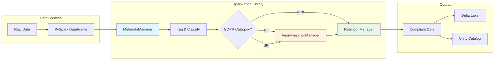

---

## Architecture

### High-Level Architecture

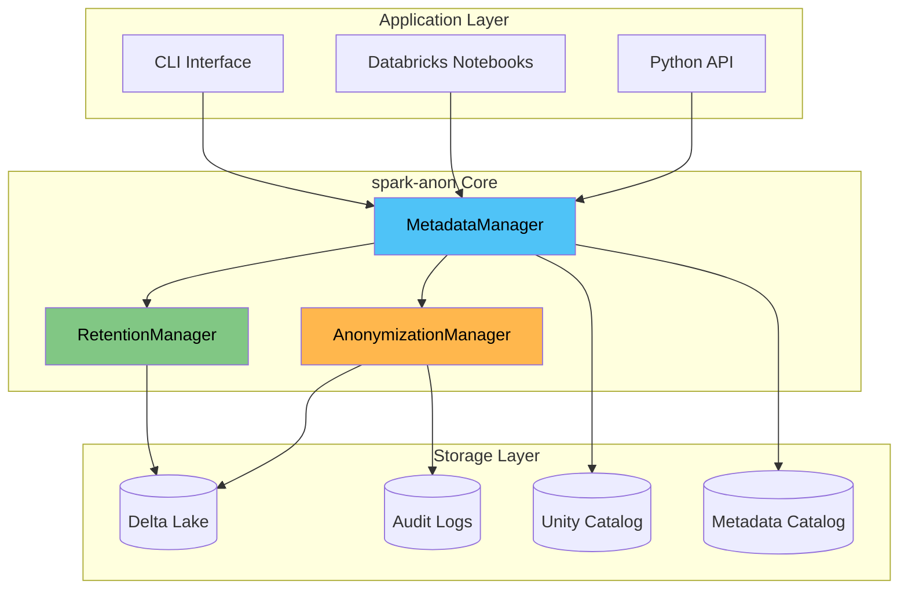

### Class Diagram

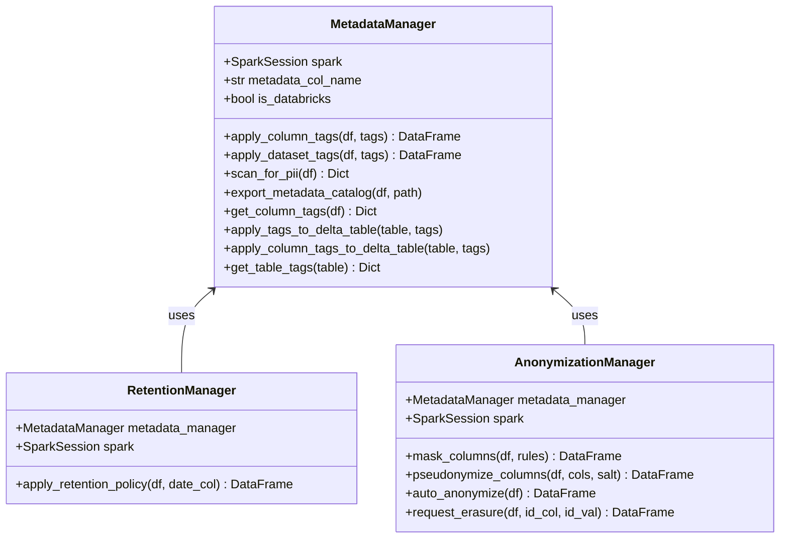

---

## Key Features

| Feature | Description | GDPR Article |
|---------|-------------|--------------|
| **Column-level tagging** | Classify data at column level | Art. 5 (Data minimization) |
| **Dataset-level tagging** | Add metadata to entire datasets | Art. 30 (Records of processing) |
| **PII Detection** | Scan column names for potential PII | Art. 35 (Impact assessment) |
| **Data Anonymization** | Hash, mask, redact, pseudonymize | Art. 32 (Security) |
| **Retention Policies** | Auto-enforce data retention | Art. 5(1)(e) (Storage limitation) |
| **Erasure Requests** | Handle "right to be forgotten" | Art. 17 (Right to erasure) |
| **Metadata Catalog** | Export compliance documentation | Art. 30 (Records) |
| **Unity Catalog Support** | Native Databricks governance | Art. 25 (Data protection by design) |

---

## Requirements

```
Python >= 3.8
PySpark >= 3.3.0
Apache Spark >= 3.3.0
```

**Optional (for Databricks):**
- Databricks Runtime 11.3+
- Unity Catalog enabled workspace

---

## Project Structure

After downloading from https://github.com/gustcol/spark-anon, you'll find the following structure:

```
spark-anon/
├── spart.py              # Main library - the core module you'll import
├── test_spart.py         # Comprehensive test suite (17 tests)
├── README.md             # This documentation file
├── .gitignore            # Git ignore configuration
└── .claude/              # Claude Code configuration (optional)
```

### File Descriptions

| File | Purpose | Size |
|------|---------|------|
| `spart.py` | Core library containing `MetadataManager`, `RetentionManager`, and `AnonymizationManager` classes | ~15 KB |
| `test_spart.py` | Unit tests covering all functionality - run with `python test_spart.py` | ~8 KB |
| `README.md` | Complete documentation with examples and diagrams | ~30 KB |

### What You Need

For most use cases, you only need **`spart.py`**. This single file contains all the functionality:

```python
# This is all you need to import
from spart import MetadataManager, RetentionManager, AnonymizationManager
```

---

## Quick Start

```python
from pyspark.sql import SparkSession
from spart import MetadataManager, RetentionManager, AnonymizationManager

# Initialize
spark = SparkSession.builder.appName("GDPR").getOrCreate()
metadata_mgr = MetadataManager(spark)
anon_mgr = AnonymizationManager(metadata_mgr)

# Load data
df = spark.read.parquet("customers.parquet")

# 1. Classify columns
tags = {
    "email": {"gdpr_category": "PII", "sensitivity": "MEDIUM"},
    "name": {"gdpr_category": "PII", "sensitivity": "HIGH"},
    "salary": {"gdpr_category": "SPI", "sensitivity": "VERY_HIGH"}
}
tagged_df = metadata_mgr.apply_column_tags(df, tags)

# 2. Auto-anonymize based on tags
anonymized_df = anon_mgr.auto_anonymize(tagged_df)

# 3. Handle erasure request
erased_df = anon_mgr.request_erasure(tagged_df, "user_id", "USR123")
```

---

## Components

### MetadataManager

The core component for managing GDPR metadata and tags.

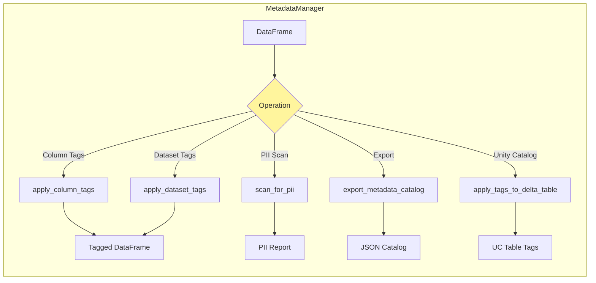

**GDPR Categories:**

| Category | Code | Description | Example Fields |
|----------|------|-------------|----------------|
| Personally Identifiable Information | `PII` | Data that can identify a person | name, email, phone |
| Sensitive Personal Information | `SPI` | Special category data (Art. 9) | health, religion, salary |
| Non-Personal Information | `NPII` | Anonymous or aggregated data | product_id, timestamp |

**Sensitivity Levels:**

| Level | Description | Recommended Action |
|-------|-------------|-------------------|
| `LOW` | Minimal risk | No anonymization needed |
| `MEDIUM` | Moderate risk | Partial masking |
| `HIGH` | High risk | Full hashing |
| `VERY_HIGH` | Critical | Pseudonymization + encryption |

### RetentionManager

Manages data retention based on tags.

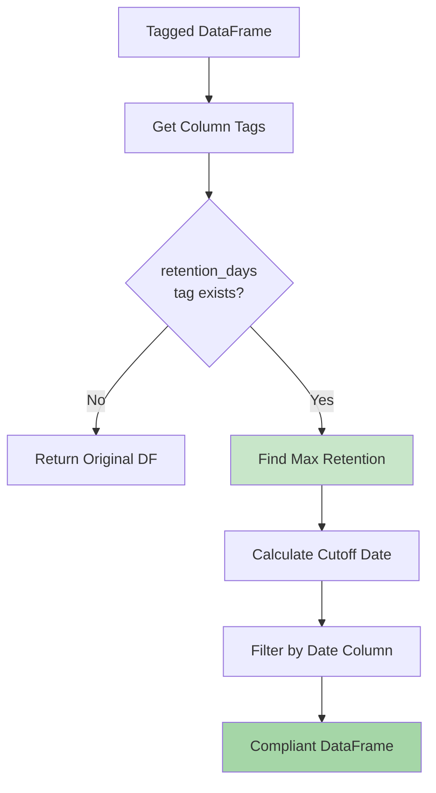

### AnonymizationManager

Handles all anonymization and erasure operations.

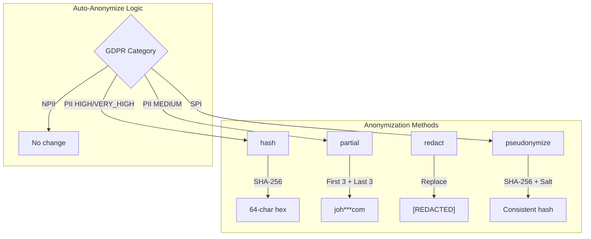

---

## Data Flow

### Complete Processing Pipeline

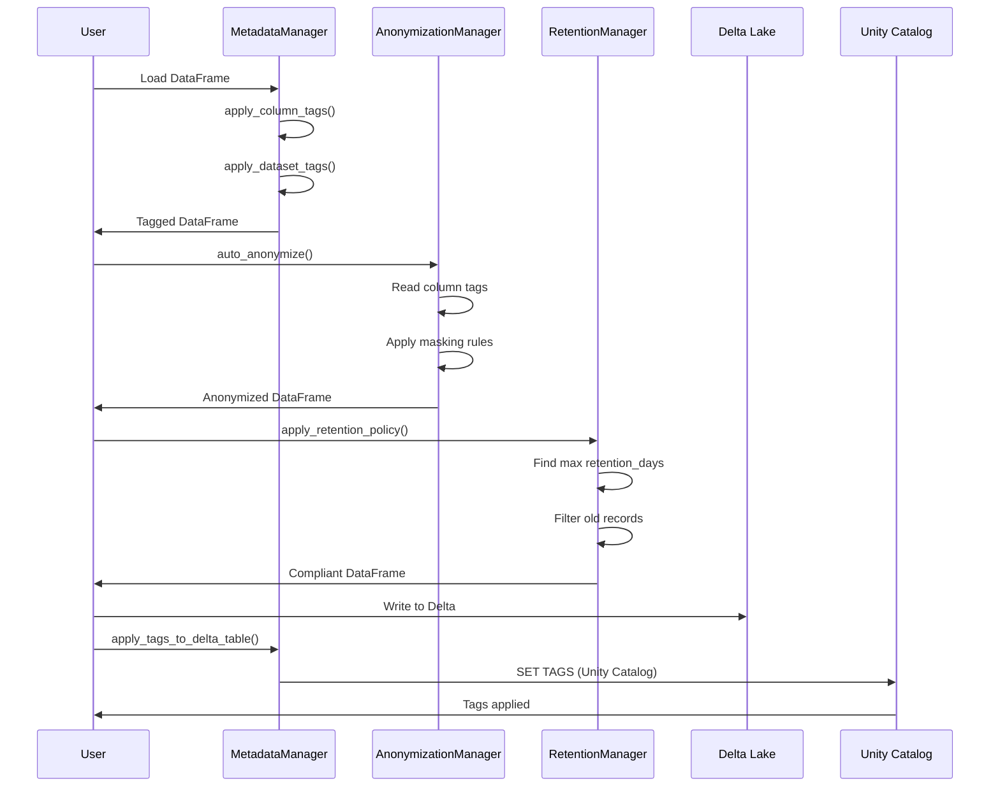

---

## GDPR Compliance Workflows

### Data Classification Flow

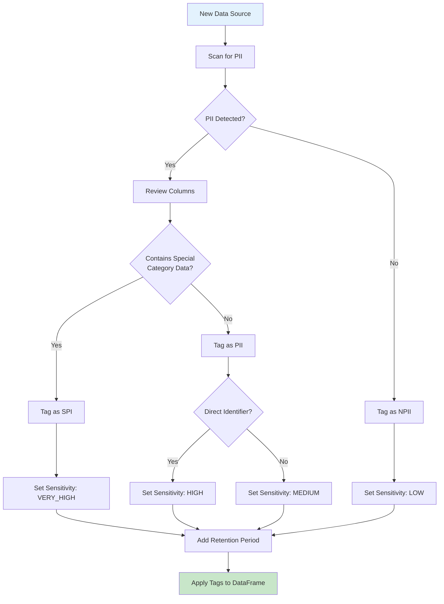

### Anonymization Decision Tree

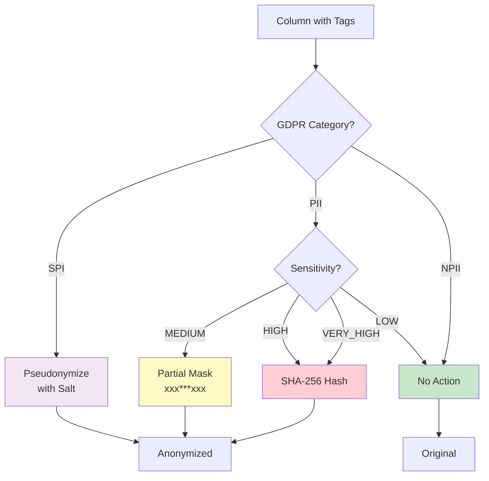

### Data Subject Erasure Flow (Right to be Forgotten)

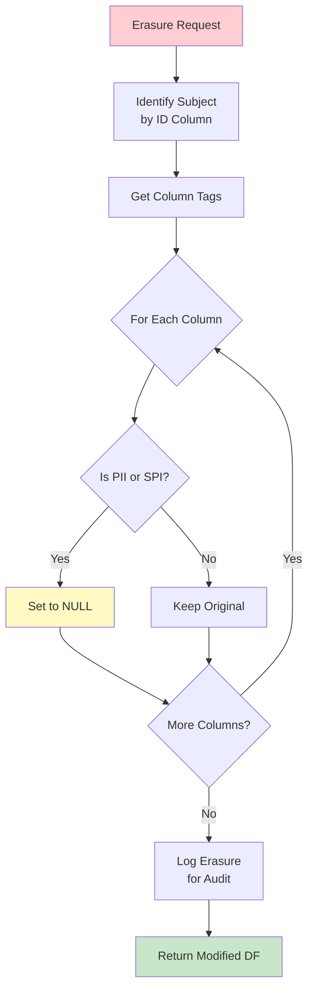

### Retention Policy Flow

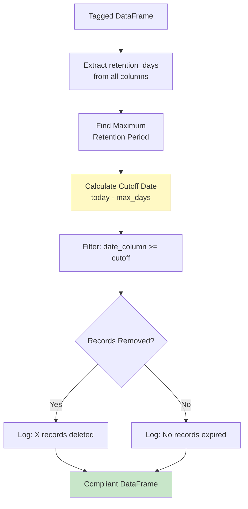

---

## Usage Examples

### Example 1: Complete GDPR Pipeline

```python
from pyspark.sql import SparkSession
from pyspark.sql.types import StructType, StructField, StringType, DoubleType, DateType
import datetime

from spart import MetadataManager, RetentionManager, AnonymizationManager

# Initialize Spark
spark = SparkSession.builder.appName("GDPR Pipeline").getOrCreate()

# Sample customer data
data = [
    ("USR001", "John Smith", "john@email.com", "123 Main St", 75000.0, datetime.date(2023, 1, 15)),
    ("USR002", "Jane Doe", "jane@email.com", "456 Oak Ave", 85000.0, datetime.date(2023, 6, 20)),
    ("USR003", "Bob Wilson", "bob@email.com", "789 Pine Rd", 65000.0, datetime.date(2024, 3, 10)),
]

schema = StructType([
    StructField("user_id", StringType(), True),
    StructField("name", StringType(), True),
    StructField("email", StringType(), True),
    StructField("address", StringType(), True),
    StructField("salary", DoubleType(), True),
    StructField("created_date", DateType(), True)
])

df = spark.createDataFrame(data, schema)

# Initialize managers
metadata_mgr = MetadataManager(spark)
retention_mgr = RetentionManager(metadata_mgr)
anon_mgr = AnonymizationManager(metadata_mgr)

# Step 1: Define GDPR tags
column_tags = {
    "user_id": {
        "gdpr_category": "PII",
        "sensitivity": "MEDIUM",
        "purpose": "identification",
        "retention_days": 3650  # 10 years
    },
    "name": {
        "gdpr_category": "PII",
        "sensitivity": "HIGH",
        "purpose": "identification",
        "retention_days": 3650
    },
    "email": {
        "gdpr_category": "PII",
        "sensitivity": "MEDIUM",
        "purpose": "contact",
        "retention_days": 1825  # 5 years
    },
    "address": {
        "gdpr_category": "PII",
        "sensitivity": "HIGH",
        "purpose": "location",
        "retention_days": 1825
    },
    "salary": {
        "gdpr_category": "SPI",
        "sensitivity": "VERY_HIGH",
        "purpose": "compensation",
        "retention_days": 2555  # 7 years
    },
    "created_date": {
        "gdpr_category": "NPII",
        "sensitivity": "LOW",
        "purpose": "audit"
    }
}

# Step 2: Apply column tags
tagged_df = metadata_mgr.apply_column_tags(df, column_tags)

# Step 3: Apply dataset tags
dataset_tags = {
    "owner": "hr_department",
    "purpose": "employee_management",
    "classification": "CONFIDENTIAL",
    "legal_basis": "employment_contract"
}
tagged_df = metadata_mgr.apply_dataset_tags(tagged_df, dataset_tags)

# Step 4: Export metadata catalog
metadata_mgr.export_metadata_catalog(tagged_df, "gdpr_catalog.json")

# Step 5: Apply anonymization for analytics
anonymized_df = anon_mgr.auto_anonymize(tagged_df)
print("Anonymized data for analytics:")
anonymized_df.select("user_id", "name", "email", "salary").show(truncate=False)

# Step 6: Apply retention policy
compliant_df = retention_mgr.apply_retention_policy(tagged_df, "created_date")
print(f"Records after retention policy: {compliant_df.count()}")

# Step 7: Handle erasure request
erased_df = anon_mgr.request_erasure(tagged_df, "user_id", "USR002")
print("After erasure request for USR002:")
erased_df.show(truncate=False)
```

### Example 2: Custom Masking Rules

```python
# Apply specific masking techniques
mask_rules = {
    "email": "partial",      # john@email.com -> joh***com
    "address": "redact",     # 123 Main St -> [REDACTED]
    "name": "hash"           # John Smith -> a1b2c3d4...
}

masked_df = anon_mgr.mask_columns(tagged_df, mask_rules)
masked_df.show(truncate=False)
```

### Example 3: Consistent Pseudonymization

```python
# Use consistent salt for reproducible pseudonyms
SALT = "my-secure-salt-store-in-secrets-manager"

pseudo_df = anon_mgr.pseudonymize_columns(
    tagged_df,
    columns=["user_id", "email"],
    salt=SALT
)

# Same salt = same pseudonym (for joins across datasets)
pseudo_df.show(truncate=False)
```

### Example 4: PII Scanning

```python
# Scan for potential PII based on column names
pii_results = metadata_mgr.scan_for_pii(df)

print("Potential PII columns:", pii_results["potential_pii"])
print("Potential SPI columns:", pii_results["potential_spi"])
print("Potential security columns:", pii_results["potential_secure"])
```

---

## Integration with Databricks & Unity Catalog

### Architecture with Unity Catalog

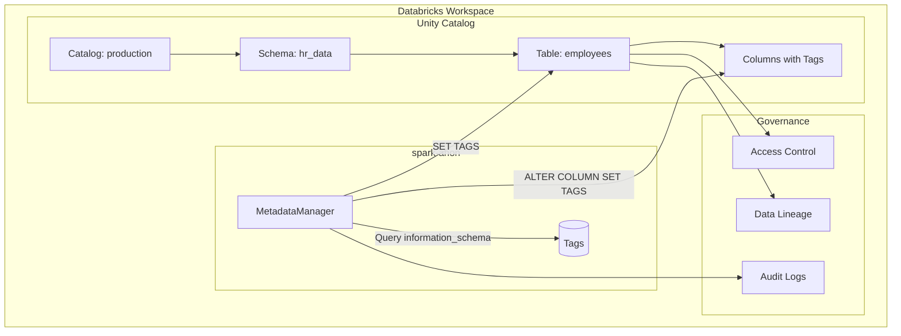

### Unity Catalog Table Tags

```python
# Apply table-level tags (Unity Catalog)
metadata_mgr.apply_tags_to_delta_table(
    "production.hr_data.employees",
    {
        "contains_pii": "true",
        "data_owner": "hr_department",
        "retention_policy": "7_years",
        "gdpr_lawful_basis": "employment_contract"
    },
    use_unity_catalog=True
)
```

### Unity Catalog Column Tags

```python
# Apply column-level tags (Unity Catalog)
column_tags = {
    "email": {
        "pii": "true",
        "sensitivity": "medium",
        "gdpr_category": "PII"
    },
    "salary": {
        "pii": "true",
        "sensitivity": "very_high",
        "gdpr_category": "SPI"
    }
}

metadata_mgr.apply_column_tags_to_delta_table(
    "production.hr_data.employees",
    column_tags
)
```

### Retrieve Existing Tags

```python
# Get tags from Unity Catalog table
tags = metadata_mgr.get_table_tags("production.hr_data.employees")
print(tags)
# {'contains_pii': 'true', 'data_owner': 'hr_department', ...}
```

### Unity Catalog vs Hive Metastore

| Feature | Unity Catalog | Hive Metastore |
|---------|---------------|----------------|
| Table naming | `catalog.schema.table` | `schema.table` |
| Table tags | `SET TAGS` | `SET TBLPROPERTIES` |
| Column tags | ✅ Supported | ❌ Not supported |
| Tag retrieval | `information_schema.table_tags` | `SHOW TBLPROPERTIES` |
| Access control | Fine-grained | Limited |
| Data lineage | Built-in | Not available |

---

## Metadata Catalog

The metadata catalog provides a complete snapshot of your data governance configuration.

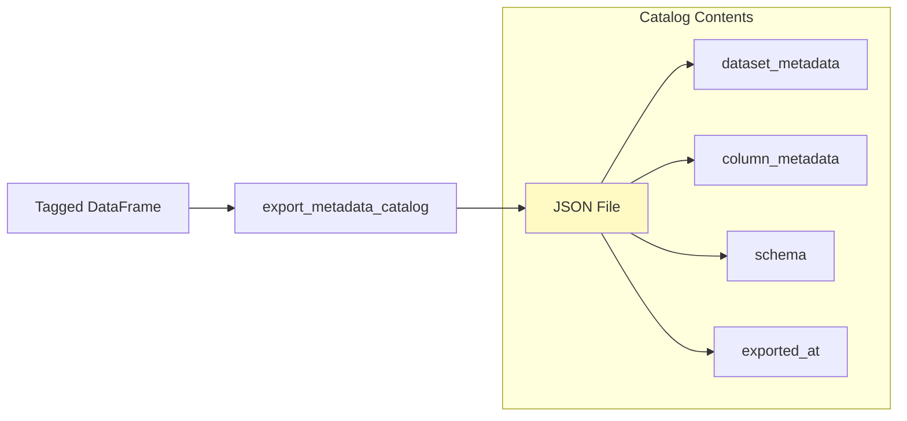

### Catalog Structure

```json
{
  "dataset_metadata": {
    "owner": "hr_department",
    "purpose": "employee_management",
    "classification": "CONFIDENTIAL",
    "timestamp": "2024-01-25T14:30:00",
    "dataset_id": "uuid-here"
  },
  "column_metadata": {
    "email": {
      "gdpr_category": "PII",
      "sensitivity": "MEDIUM",
      "retention_days": 1825,
      "purpose": "contact"
    },
    "salary": {
      "gdpr_category": "SPI",
      "sensitivity": "VERY_HIGH",
      "retention_days": 2555,
      "purpose": "compensation"
    }
  },
  "schema": "StructType([...])",
  "exported_at": "2024-01-25T14:30:00"
}
```

---

## Testing

Run the comprehensive test suite:

```bash
python test_spart.py
```

### Test Coverage

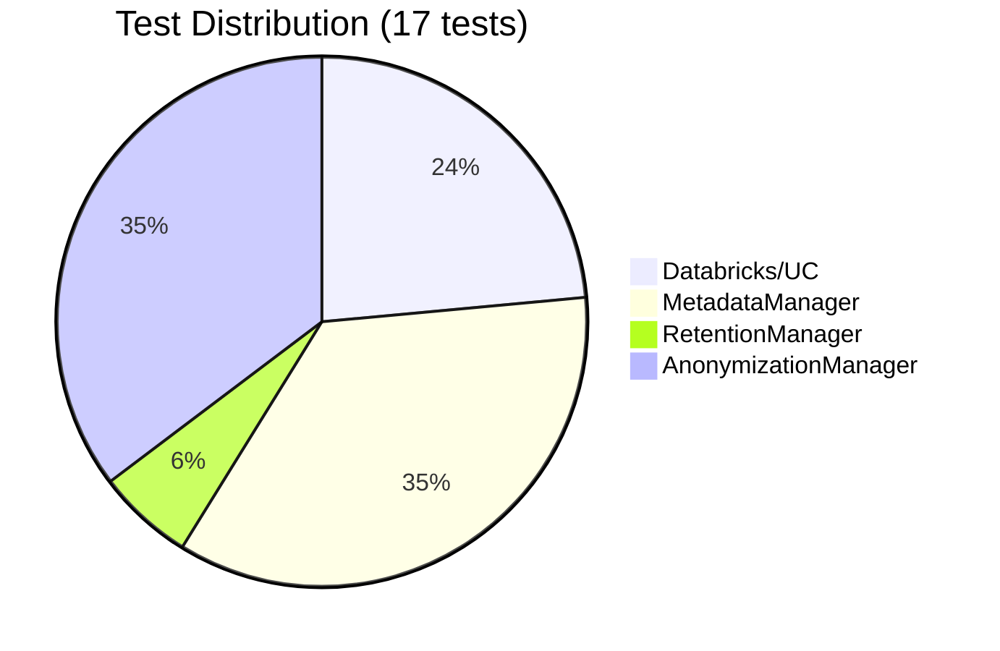

| Test Category | Tests | Coverage |
|---------------|-------|----------|
| Databricks/Unity Catalog | 4 | Environment detection, error handling |
| MetadataManager | 6 | Tagging, validation, PII scan, export |
| RetentionManager | 1 | Retention policy application |
| AnonymizationManager | 6 | All masking types, erasure |

---

## Performance Optimizations

### Batch Operations

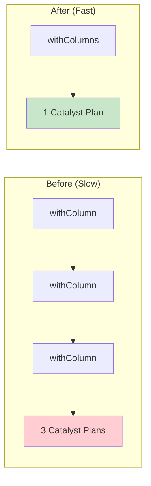

**Performance Benefits:**
- Single logical plan instead of chained transformations
- Reduced Catalyst optimizer overhead
- Cleaner execution plans
- Lower memory footprint

### Optimization Techniques Used

| Technique | Where Applied | Benefit |
|-----------|---------------|---------|
| `withColumns()` batch | mask_columns, pseudonymize, erasure | 3-5x faster |
| Lazy evaluation | Metadata parsing | Reduced memory |
| Partition hints | Retention filtering | Better parallelism |

---

## Security Considerations

### SQL Injection Protection

```python
# All inputs are sanitized before SQL execution
sanitized_tags = {
    k.replace("'", "''").replace("\\", "\\\\"):
    v.replace("'", "''").replace("\\", "\\\\")
    for k, v in tags.items()
}
```

### Best Practices

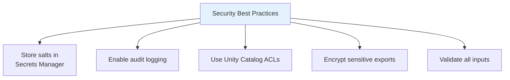

1. **Salt Management**: Store pseudonymization salts in AWS Secrets Manager, Azure Key Vault, or Databricks Secrets
2. **Audit Logging**: Enable Spark event logging for compliance
3. **Access Control**: Use Unity Catalog for fine-grained permissions
4. **Encryption**: Encrypt metadata catalog exports for sensitive environments

---

## Troubleshooting

### Common Issues

| Issue | Cause | Solution |
|-------|-------|----------|
| `EnvironmentError: Databricks` | Using UC methods outside Databricks | Use `use_unity_catalog=False` or run in Databricks |
| `ValueError: Invalid GDPR category` | Typo in category name | Use: `PII`, `SPI`, or `NPII` |
| `Column not found` | Column name mismatch | Check column names with `df.columns` |
| Tags not persisting | DataFrame recreated | Apply tags after final transformations |

### Debug Mode

```python
import logging
logging.getLogger("spart").setLevel(logging.DEBUG)
```

---

## Roadmap

### Future Enhancements

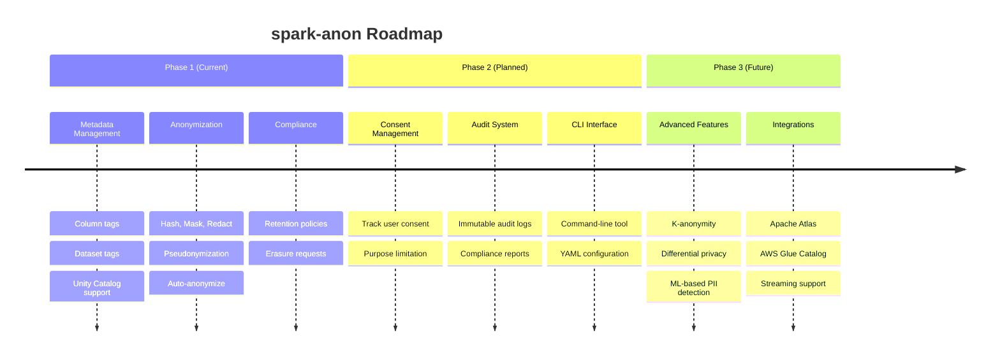

### Planned Features

| Feature | Priority | Description |
|---------|----------|-------------|
| Consent Manager | High | Track and enforce user consent |
| Audit Logging | High | Immutable compliance audit trail |
| CLI Interface | Medium | Command-line operations |
| YAML Config | Medium | Configuration file support |
| K-Anonymity | Low | Advanced anonymization |
| Streaming Support | Low | Real-time processing |

---

## Contributing

Contributions are welcome! Please follow these steps:

1. Fork the repository
2. Create a feature branch (`git checkout -b feature/AmazingFeature`)
3. Write tests for new functionality
4. Ensure all tests pass (`python test_spart.py`)
5. Run code quality checks (`ty check spart.py && ruff check spart.py`)
6. Commit changes (`git commit -m 'Add AmazingFeature'`)
7. Push to branch (`git push origin feature/AmazingFeature`)
8. Open a Pull Request

---

## License

This project is open source. See LICENSE file for details.

---

## References

- [GDPR Official Text](https://gdpr-info.eu/)
- [PySpark Documentation](https://spark.apache.org/docs/latest/api/python/)
- [Databricks Unity Catalog](https://docs.databricks.com/data-governance/unity-catalog/index.html)
- [Delta Lake Documentation](https://docs.delta.io/)
