# spark-anon - Spark GDPR & Privacy Library

A comprehensive Spark library for managing metadata, tags, and GDPR compliance in data processing pipelines. This library provides tools for implementing standardized metadata, enforcing data retention policies, applying anonymization techniques to sensitive data, and handling data subject rights requests like erasure.

## Table of Contents

- [Download & Installation](#download--installation)
  - [Method 1: Git Clone (Recommended)](#method-1-git-clone-recommended)
  - [Method 2: Download ZIP](#method-2-download-zip)
  - [Method 3: curl/wget (Single File)](#method-3-curlwget-single-file)
  - [Method 4: GitHub CLI](#method-4-github-cli)
  - [Method 5: Databricks Integration](#method-5-databricks-integration)
- [Overview](#overview)
- [Architecture](#architecture)
- [Key Features](#key-features)
- [Requirements](#requirements)
- [Quick Start](#quick-start)
- [Project Structure](#project-structure)
- [Components](#components)
  - [ConfigManager](#configmanager)
  - [AuditManager](#auditmanager)
  - [ConsentManager](#consentmanager)
  - [PIIDetector](#piidetector)
  - [MetadataManager](#metadatamanager)
  - [RetentionManager](#retentionmanager)
  - [AnonymizationManager](#anonymizationmanager)
  - [AdvancedAnonymization](#advancedanonymization)
  - [PandasProcessor](#pandasprocessor)
  - [BackendSelector & Benchmark](#backendselector--benchmark)
  - [StreamingManager](#streamingmanager)
  - [ApacheAtlasClient](#apacheatlasclient)
  - [AWSGlueCatalogClient](#awsgluecatalogclient)
  - [MLPIIDetector](#mlpiidetector)
  - [DataLineageTracker](#datalineagetracker)
- [Data Flow](#data-flow)
- [GDPR Compliance Workflows](#gdpr-compliance-workflows)
  - [Data Classification Flow](#data-classification-flow)
  - [Anonymization Decision Tree](#anonymization-decision-tree)
  - [Data Subject Erasure Flow](#data-subject-erasure-flow)
  - [Retention Policy Flow](#retention-policy-flow)
- [Usage Examples](#usage-examples)
- [Pandas Backend & Performance](#pandas-backend--performance)
- [CLI Interface](#cli-interface)
- [Integration with Databricks & Unity Catalog](#integration-with-databricks--unity-catalog)
- [Metadata Catalog](#metadata-catalog)
- [Testing](#testing)
- [Performance Optimizations](#performance-optimizations)
- [Security Considerations](#security-considerations)
- [Troubleshooting](#troubleshooting)
- [Roadmap](#roadmap)
- [Contributing](#contributing)
- [References](#references)

---

## Download & Installation

This section provides detailed instructions for downloading **spark-anon** from GitHub. Choose the method that best fits your environment and workflow.

### Prerequisites

Before downloading, ensure you have:

- **Python 3.8+** installed
- **Git** (for clone method) or **curl/wget** (for direct download)
- **PySpark 3.3.0+** installed in your environment

### Method 1: Git Clone (Recommended)

The most common and recommended method. This gives you the full repository with version control.

```bash
# Step 1: Navigate to your project directory
cd /path/to/your/projects

# Step 2: Clone the repository
git clone https://github.com/gustcol/spark-anon.git

# Step 3: Navigate into the cloned directory
cd spark-anon

# Step 4: Verify the files
ls -la
# Expected output:
#   spart.py          - Main library file
#   test_spart.py     - Test suite
#   README.md         - Documentation
#   .gitignore        - Git ignore rules
```

**Advantages:**
- Full version history
- Easy to pull updates with `git pull`
- Can switch between branches/versions
- Contribution-ready (fork and PR workflow)

### Method 2: Download ZIP

If you don't have Git installed or prefer a simple download.

```bash
# Option A: Using curl
curl -L -o spark-anon.zip https://github.com/gustcol/spark-anon/archive/refs/heads/main.zip

# Option B: Using wget
wget https://github.com/gustcol/spark-anon/archive/refs/heads/main.zip -O spark-anon.zip

# Extract the ZIP file
unzip spark-anon.zip

# The extracted folder will be named "spark-anon-main"
cd spark-anon-main
```

**Alternative: Download via Browser**
1. Go to https://github.com/gustcol/spark-anon
2. Click the green **"Code"** button
3. Select **"Download ZIP"**
4. Extract the downloaded file to your desired location

### Method 3: curl/wget (Single File)

If you only need the main library file (`spart.py`), you can download it directly.

```bash
# Download only spart.py using curl
curl -O https://raw.githubusercontent.com/gustcol/spark-anon/main/spart.py

# Or using wget
wget https://raw.githubusercontent.com/gustcol/spark-anon/main/spart.py

# Verify the download
head -20 spart.py
```

**URL Structure Explained:**
- `https://raw.githubusercontent.com/` - GitHub's raw content server
- `gustcol/spark-anon` - Repository owner/name
- `main` - Branch name
- `spart.py` - File path in the repository

### Method 4: GitHub CLI

If you have GitHub CLI (`gh`) installed:

```bash
# Clone using GitHub CLI
gh repo clone gustcol/spark-anon

# Or download a specific release (if available)
gh release download --repo gustcol/spark-anon
```

**Installing GitHub CLI:**
```bash
# macOS (Homebrew)
brew install gh

# Ubuntu/Debian
sudo apt install gh

# Windows (Chocolatey)
choco install gh
```

### Method 5: Databricks Integration

For Databricks environments, you have several options:

#### Option A: Databricks Repos (Recommended for Teams)

```python
# 1. In Databricks Workspace, go to Repos
# 2. Click "Add Repo"
# 3. Enter: https://github.com/gustcol/spark-anon.git
# 4. Click "Create Repo"

# In your notebook, import directly:
from spart import MetadataManager, RetentionManager, AnonymizationManager
```

#### Option B: Upload to DBFS

```bash
# On your local machine, download the file first
curl -O https://raw.githubusercontent.com/gustcol/spark-anon/main/spart.py

# Upload to Databricks using CLI
databricks fs cp spart.py dbfs:/FileStore/libs/spart.py
```

```python
# In your Databricks notebook
import sys
sys.path.append("/dbfs/FileStore/libs/")

from spart import MetadataManager, RetentionManager, AnonymizationManager
```

#### Option C: Databricks Workspace Files

```python
# Upload spart.py to your workspace folder via UI
# Then in your notebook:
%run ./spart
```

### Verifying the Installation

After downloading, verify everything works:

```python
# Quick verification script
from pyspark.sql import SparkSession
from spart import MetadataManager, RetentionManager, AnonymizationManager

# Initialize Spark
spark = SparkSession.builder.appName("spark-anon-test").getOrCreate()

# Create managers
metadata_mgr = MetadataManager(spark)
print("MetadataManager initialized successfully!")

# Check version/capabilities
print(f"GDPR Categories: {metadata_mgr.GDPR_CATEGORIES}")
print(f"Sensitivity Levels: {metadata_mgr.SENSITIVITY_LEVELS}")

print("spark-anon is ready to use!")
```

### Keeping Up to Date

#### If you used Git Clone:
```bash
cd spark-anon
git pull origin main
```

#### If you downloaded manually:
Re-download the file using the same method when updates are released.

### Troubleshooting Download Issues

| Issue | Cause | Solution |
|-------|-------|----------|
| `404 Not Found` | Repository is private or URL typo | Verify URL: https://github.com/gustcol/spark-anon |
| `Permission denied` | No read access to repo | Ensure repository is public or you have access |
| `SSL certificate error` | Corporate proxy/firewall | Try `curl -k` (insecure) or configure proxy |
| `Command not found: git` | Git not installed | Install Git: `apt install git` or `brew install git` |

---

## Overview

The Spark GDPR & Privacy Library provides a structured approach to implementing data governance, privacy standards, and GDPR compliance within Apache Spark and Databricks environments.

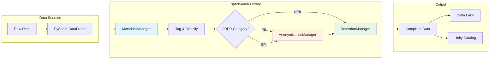

---

## Architecture

### High-Level Architecture

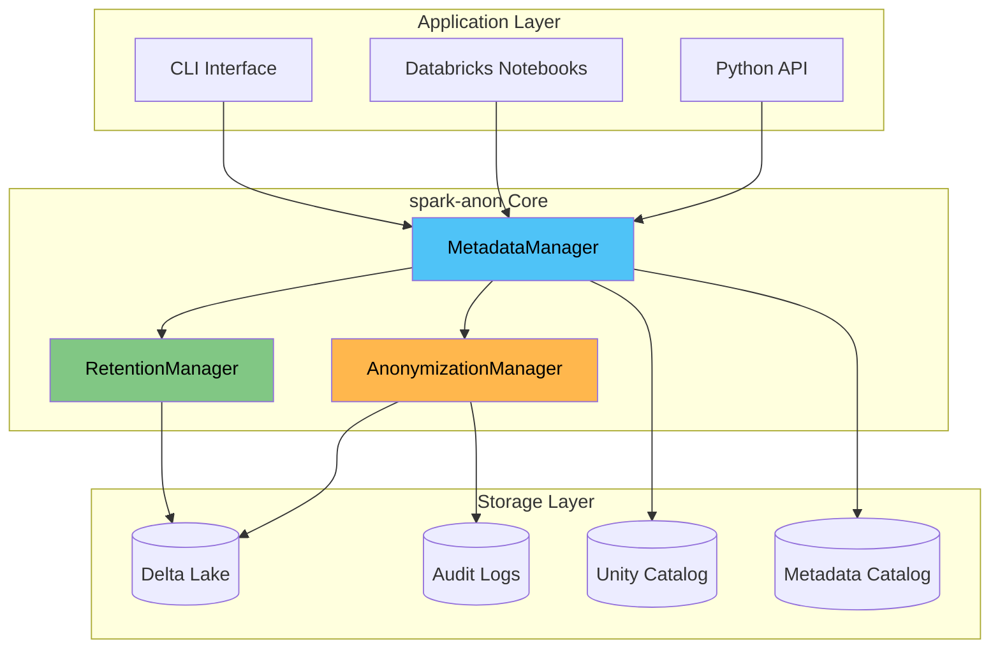

### Class Diagram

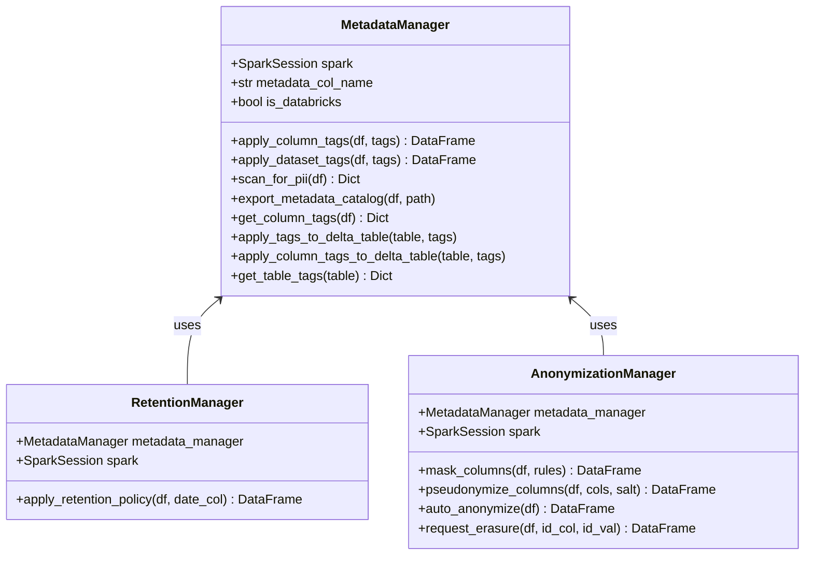

---

## Key Features

| Feature | Description | GDPR Article |
|---------|-------------|--------------|
| **Column-level tagging** | Classify data at column level | Art. 5 (Data minimization) |
| **Dataset-level tagging** | Add metadata to entire datasets | Art. 30 (Records of processing) |
| **PII Detection** | Scan column names and content for potential PII | Art. 35 (Impact assessment) |
| **Data Anonymization** | Hash, mask, redact, pseudonymize | Art. 32 (Security) |
| **K-Anonymity** | Ensure k-indistinguishability for quasi-identifiers | Art. 32 (Security) |
| **Differential Privacy** | Add calibrated noise using Laplace mechanism | Art. 32 (Security) |
| **Consent Management** | Track and enforce user consent by purpose | Art. 6, 7 (Lawful basis, Consent) |
| **Audit Logging** | Immutable audit trail for all operations | Art. 30 (Records of processing) |
| **Retention Policies** | Auto-enforce data retention | Art. 5(1)(e) (Storage limitation) |
| **Erasure Requests** | Handle "right to be forgotten" | Art. 17 (Right to erasure) |
| **YAML Configuration** | Centralized configuration following 12-factor app | Art. 25 (Data protection by design) |
| **Pandas Backend** | Fast processing for smaller datasets | Art. 32 (Security - efficiency) |
| **Benchmarking** | Compare Spark vs Pandas performance | Art. 25 (Data protection by design) |
| **Streaming Support** | Real-time anonymization with Spark Streaming | Art. 32 (Security) |
| **CLI Interface** | Command-line tool for operations | Art. 25 (Data protection by design) |
| **Metadata Catalog** | Export compliance documentation | Art. 30 (Records) |
| **Unity Catalog Support** | Native Databricks governance | Art. 25 (Data protection by design) |
| **Apache Atlas Integration** | Enterprise metadata management | Art. 30 (Records of processing) |
| **AWS Glue Catalog** | AWS-native data governance | Art. 25 (Data protection by design) |
| **ML PII Detection** | NLP-based PII identification | Art. 35 (Impact assessment) |
| **Data Lineage Tracking** | Track data transformations | Art. 5, 30 (Accountability) |

---

## Requirements

**Required:**
```
Python >= 3.8
PySpark >= 3.3.0
Apache Spark >= 3.3.0
```

**Optional (for enhanced features):**
```
pandas >= 2.2.0        # For PandasProcessor backend
numpy >= 1.24.0        # For differential privacy
PyYAML >= 6.0          # For YAML configuration
packaging >= 21.0      # For version checking
requests >= 2.28.0     # For Apache Atlas integration
boto3 >= 1.26.0        # For AWS Glue integration
spacy >= 3.5.0         # For ML PII detection (spaCy backend)
transformers >= 4.30.0 # For ML PII detection (Hugging Face backend)
```

**Optional (for Databricks):**
- Databricks Runtime 11.3+
- Unity Catalog enabled workspace

---

## Project Structure

After downloading from https://github.com/gustcol/spark-anon, you'll find the following structure:

```
spark-anon/
├── spart.py              # Main library - the core module you'll import
├── test_spart.py         # Comprehensive test suite (84 tests)
├── README.md             # This documentation file
└── .gitignore            # Git ignore configuration
```

### File Descriptions

| File | Purpose | Size |
|------|---------|------|
| `spart.py` | Core library containing all GDPR compliance classes | ~50 KB |
| `test_spart.py` | Comprehensive test suite (84 tests) - run with `python test_spart.py` | ~40 KB |
| `README.md` | Complete documentation with examples and diagrams | ~45 KB |

### What You Need

For most use cases, you only need **`spart.py`**. This single file contains all the functionality:

```python
# Core imports
from spart import MetadataManager, RetentionManager, AnonymizationManager

# Additional features
from spart import (
    ConfigManager,            # YAML configuration
    AuditManager,            # Audit logging
    ConsentManager,          # Consent tracking
    PIIDetector,             # PII detection
    AdvancedAnonymization,   # K-anonymity, differential privacy
    PandasProcessor,         # Fast pandas backend
    BackendSelector,         # Auto backend selection
    Benchmark,               # Performance benchmarking
    StreamingManager,        # Streaming support
)

# Enums and data classes
from spart import (
    GDPRCategory,            # PII, SPI, NPII
    SensitivityLevel,        # LOW, MEDIUM, HIGH, VERY_HIGH
    ConsentStatus,           # GRANTED, DENIED, WITHDRAWN, EXPIRED
    ProcessingBackend,       # SPARK, PANDAS, AUTO
    AuditEventType,          # DATA_ACCESS, ANONYMIZATION, etc.
)
```

---

## Quick Start

```python
from pyspark.sql import SparkSession
from spart import (
    MetadataManager, RetentionManager, AnonymizationManager,
    ConfigManager, AuditManager, ConsentManager, PIIDetector,
    ConsentStatus
)

# Initialize with configuration and audit logging
spark = SparkSession.builder.appName("GDPR").getOrCreate()
config = ConfigManager()  # Uses defaults, or pass "config.yaml"
audit = AuditManager(config, log_path="./audit_logs")
metadata_mgr = MetadataManager(spark, config=config, audit_manager=audit)
anon_mgr = AnonymizationManager(metadata_mgr, audit)

# Load data
df = spark.read.parquet("customers.parquet")

# 1. Scan for PII (optional - helps identify sensitive columns)
detector = PIIDetector(config)
pii_report = detector.full_scan(df, sample_size=100)
print(f"Detected PII columns: {pii_report['column_name_analysis']['potential_pii']}")

# 2. Classify columns
tags = {
    "email": {"gdpr_category": "PII", "sensitivity": "MEDIUM"},
    "name": {"gdpr_category": "PII", "sensitivity": "HIGH"},
    "salary": {"gdpr_category": "SPI", "sensitivity": "VERY_HIGH"}
}
tagged_df = metadata_mgr.apply_column_tags(df, tags)

# 3. Auto-anonymize based on tags
anonymized_df = anon_mgr.auto_anonymize(tagged_df)

# 4. Handle erasure request (right to be forgotten)
erased_df = anon_mgr.request_erasure(tagged_df, "user_id", "USR123")

# 5. Generate compliance report
from datetime import datetime, timedelta
report = audit.generate_compliance_report(
    start=datetime.now() - timedelta(days=30),
    end=datetime.now()
)
```

---

## Components

### ConfigManager

Configuration management following the [12-factor app](https://12factor.net/) methodology. Supports YAML files, environment variable overrides, and sensible defaults.

```python
from spart import ConfigManager

# Load from YAML file with environment overrides
config = ConfigManager("config.yaml")

# Get nested configuration values
threshold = config.get("processing", "pandas_threshold_rows")  # 100000
hash_algo = config.get("anonymization", "default_hash_algorithm")  # "sha256"

# Set values programmatically
config.set("anonymization", "k_anonymity_default_k", 5)

# Validate configuration
errors = config.validate()
if errors:
    print(f"Configuration errors: {errors}")

# Save to file
config.save_to_file("config_backup.yaml")
```

**Environment Variable Override Pattern:**
```bash
# Environment variables override YAML config
export SPART_PROCESSING_PANDAS_THRESHOLD_ROWS=50000
export SPART_ANONYMIZATION_K_ANONYMITY_DEFAULT_K=10
```

### AuditManager

Immutable audit logging for GDPR compliance. Generates compliance reports and Data Subject Access Request (DSAR) reports.

```python
from spart import AuditManager, AuditEventType

audit = AuditManager(log_path="./audit_logs")

# Log events
audit.log_event(
    event_type=AuditEventType.DATA_ACCESS,
    actor="analyst@company.com",
    action="query",
    resource="customer_table",
    details={"query": "SELECT * FROM customers", "row_count": 1000}
)

# Log erasure request
audit.log_event(
    event_type=AuditEventType.ERASURE_REQUEST,
    actor="privacy@company.com",
    action="erase",
    resource="customer_table",
    subject_ids=["USR001", "USR002"],
    success=True
)

# Generate compliance report
from datetime import datetime, timedelta
start = datetime.now() - timedelta(days=30)
end = datetime.now()
report = audit.generate_compliance_report(start, end)

# Generate DSAR report
dsar = audit.get_subject_access_report("USR001")
```

**Audit Event Types:**
- `DATA_ACCESS` - Data read operations
- `DATA_MODIFICATION` - Data update/insert operations
- `DATA_DELETION` - Data removal operations
- `ANONYMIZATION` - Anonymization applied
- `ERASURE_REQUEST` - Right to erasure request
- `CONSENT_CHANGE` - Consent granted/withdrawn
- `POLICY_VIOLATION` - Policy violation detected
- `EXPORT` - Data export operation

### ConsentManager

Track and enforce user consent by purpose. Supports consent expiration and withdrawal.

```python
from spart import ConsentManager, ConsentStatus

consent = ConsentManager(spark, storage_path="./consent_data")

# Record consent
consent.record_consent(
    subject_id="USR001",
    purpose="analytics",
    status=ConsentStatus.GRANTED,
    legal_basis="explicit_consent",
    expires_in_days=365
)

# Check consent before processing
has_consent, record = consent.check_consent("USR001", "analytics")
if has_consent:
    # Process data for analytics
    pass

# Withdraw consent
consent.withdraw_consent("USR001", "marketing")

# Get all consents for a subject (for DSAR)
all_consents = consent.get_all_consents("USR001")
```

**Valid Purposes:**
- `analytics` - Statistical analysis
- `marketing` - Marketing communications
- `research` - Research activities
- `personalization` - Personalized experiences
- `third_party_sharing` - Sharing with third parties
- `profiling` - Automated profiling

### PIIDetector

Scan DataFrames for potential PII using pattern matching on column names and content.

```python
from spart import PIIDetector

detector = PIIDetector()

# Scan column names
name_results = detector.scan_column_names(df)
print(f"Potential PII columns: {name_results['potential_pii']}")
print(f"Potential SPI columns: {name_results['potential_spi']}")

# Scan content with pattern matching
content_results = detector.scan_content(df, sample_size=100)
for col, patterns in content_results.items():
    print(f"Column {col} contains: {patterns}")

# Full scan (names + content)
full_results = detector.full_scan(df, sample_size=100)

# Get suggested tags based on scan
suggestions = detector.get_suggested_tags(full_results)

# Add custom patterns
detector.add_pattern("brazilian_cpf", r"\d{3}\.\d{3}\.\d{3}-\d{2}")
```

**Built-in Patterns:**
- `email` - Email addresses
- `phone` - Phone numbers
- `ssn` - Social Security Numbers
- `credit_card` - Credit card numbers
- `ip_address` - IP addresses
- `date_of_birth` - Date patterns

### MetadataManager

The core component for managing GDPR metadata and tags.

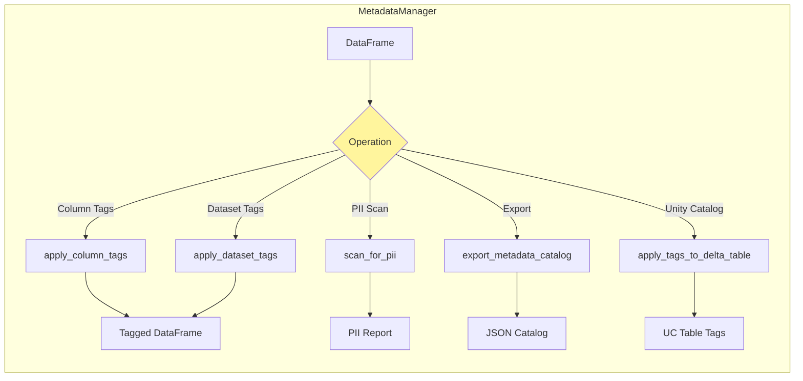

**GDPR Categories:**

| Category | Code | Description | Example Fields |
|----------|------|-------------|----------------|
| Personally Identifiable Information | `PII` | Data that can identify a person | name, email, phone |
| Sensitive Personal Information | `SPI` | Special category data (Art. 9) | health, religion, salary |
| Non-Personal Information | `NPII` | Anonymous or aggregated data | product_id, timestamp |

**Sensitivity Levels:**

| Level | Description | Recommended Action |
|-------|-------------|-------------------|
| `LOW` | Minimal risk | No anonymization needed |
| `MEDIUM` | Moderate risk | Partial masking |
| `HIGH` | High risk | Full hashing |
| `VERY_HIGH` | Critical | Pseudonymization + encryption |

### RetentionManager

Manages data retention based on tags.

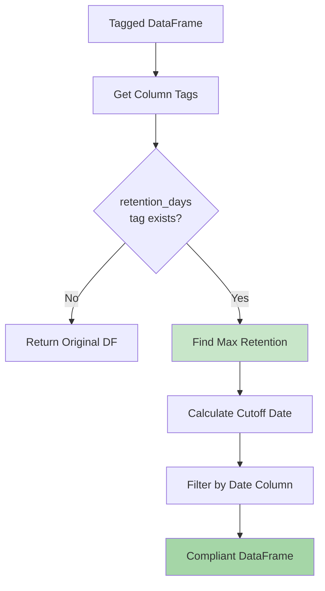

### AnonymizationManager

Handles all anonymization and erasure operations.

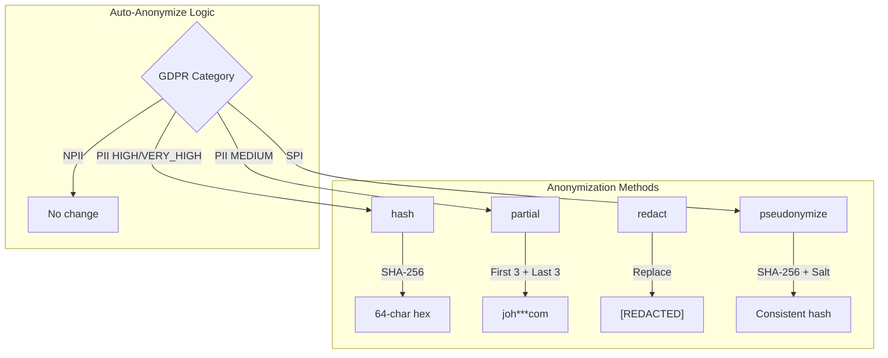

### AdvancedAnonymization

Implements advanced privacy techniques: K-anonymity, differential privacy, and data generalization.

```python
from spart import AdvancedAnonymization

advanced = AdvancedAnonymization(spark)

# Check K-anonymity
result = advanced.check_k_anonymity(df, quasi_identifiers=["age", "zip_code"], k=5)
print(f"Is 5-anonymous: {result['is_k_anonymous']}")
print(f"Compliance rate: {result['compliance_rate']}%")

# Apply K-anonymity (suppress non-compliant groups)
k_anon_df = advanced.k_anonymize(df, quasi_identifiers=["age", "zip_code"], k=5)

# Add differential privacy noise (Laplace mechanism)
noisy_df = advanced.add_differential_privacy_noise(
    df,
    numeric_columns=["salary", "age"],
    epsilon=1.0  # Privacy budget
)

# Generalize numeric values into ranges
generalized = advanced.generalize_numeric(df, "age", bin_size=10.0)
# 25 -> "20-30", 47 -> "40-50"

# Generalize dates
date_gen = advanced.generalize_date(df, "birth_date", level="year")
# 2024-03-15 -> "2024"
```

**K-Anonymity Explained:**
K-anonymity ensures that each record is indistinguishable from at least k-1 other records based on quasi-identifiers. This prevents re-identification attacks.

**Differential Privacy Explained:**
Adds calibrated random noise to numeric data using the Laplace mechanism. The epsilon parameter controls the privacy-utility tradeoff (lower epsilon = more privacy, more noise).

### PandasProcessor

Fast pandas-based processing for smaller datasets. Provides the same functionality as Spark-based managers but with significantly better performance for datasets under 100,000 rows.

```python
from spart import PandasProcessor
import pandas as pd

processor = PandasProcessor()

# Apply column tags
processor.apply_column_tags(pandas_df, {
    "email": {"gdpr_category": "PII", "sensitivity": "MEDIUM"},
    "salary": {"gdpr_category": "SPI", "sensitivity": "VERY_HIGH"}
})

# Mask columns
masked = processor.mask_columns(pandas_df, {
    "email": "hash",      # SHA-256 hash
    "name": "partial",    # joh***com
    "address": "redact"   # [REDACTED]
})

# Pseudonymize with consistent salt
pseudo = processor.pseudonymize_columns(pandas_df, ["user_id"], salt="secret")

# Auto-anonymize based on tags
anonymized = processor.auto_anonymize(pandas_df)

# Handle erasure request
erased = processor.request_erasure(pandas_df, "user_id", "USR001")

# K-anonymity
k_anon = processor.k_anonymize(pandas_df, ["age", "zip_code"], k=5)

# Differential privacy
noisy = processor.add_differential_privacy_noise(pandas_df, ["salary"], epsilon=1.0)
```

### BackendSelector & Benchmark

Automatically select the optimal processing backend based on data size, and benchmark performance.

```python
from spart import BackendSelector, Benchmark, ProcessingBackend

# Automatic backend selection
selector = BackendSelector(spark)

# Auto-select based on row count
backend = selector.get_backend(row_count=5000)  # Returns PANDAS for small data
backend = selector.get_backend(row_count=500000)  # Returns SPARK for large data

# Force a specific backend
backend = selector.get_backend(row_count=5000, force_backend=ProcessingBackend.SPARK)

# Convert between backends
pandas_df = selector.convert_spark_to_pandas(spark_df)
spark_df = selector.convert_pandas_to_spark(pandas_df)

# Benchmark operations
benchmark = Benchmark(spark)

def my_spark_operation():
    return anon_mgr.mask_columns(df, {"email": "hash"})

def my_pandas_operation():
    return processor.mask_columns(pdf, {"email": "hash"})

results = benchmark.benchmark_operation(
    name="hash_email",
    spark_func=my_spark_operation,
    pandas_func=my_pandas_operation,
    row_count=10000,
    column_count=10
)

print(f"Spark time: {results['spark'].execution_time_seconds}s")
print(f"Pandas time: {results['pandas'].execution_time_seconds}s")
print(f"Recommendation: {results['recommendation']}")

# Run comprehensive benchmark suite
suite_results = benchmark.run_benchmark_suite(row_counts=[1000, 10000, 100000])
```

**Default Thresholds:**
- Rows < 100,000 → Pandas (faster for small data)
- Rows >= 100,000 → Spark (better scalability)

### StreamingManager

Real-time anonymization with Spark Structured Streaming.

```python
from spart import StreamingManager

streaming = StreamingManager(spark, metadata_mgr, anon_mgr)

# Define column tags for streaming data
column_tags = {
    "email": {"gdpr_category": "PII", "sensitivity": "MEDIUM"},
    "name": {"gdpr_category": "PII", "sensitivity": "HIGH"}
}

# Create streaming pipeline
query = streaming.create_anonymization_stream(
    source_path="/data/streaming/input",
    target_path="/data/streaming/output",
    column_tags=column_tags,
    checkpoint_path="/data/streaming/checkpoints",
    trigger_interval="10 seconds"
)

# Monitor the stream
print(f"Stream status: {query.status}")
print(f"Recent progress: {query.lastProgress}")

# Stop when done
query.stop()
```

### ApacheAtlasClient

Enterprise metadata management integration with Apache Atlas. Provides bidirectional synchronization of GDPR metadata with Atlas classification system.

```python
from spart import ApacheAtlasClient

atlas = ApacheAtlasClient(
    atlas_url="http://atlas-server:21000",
    username="admin",
    password="admin"
)

# Create GDPR classification types in Atlas
result = atlas.create_gdpr_classification_types()
# Creates: gdpr_pii, gdpr_spi, gdpr_npii classifications

# Sync table metadata to Atlas
column_tags = {
    "email": {"gdpr_category": "PII", "sensitivity": "HIGH"},
    "ssn": {"gdpr_category": "SPI", "sensitivity": "VERY_HIGH"}
}
atlas.sync_table_metadata("customer_table", column_tags)

# Apply classification to specific entity
atlas.apply_classification_to_entity(
    entity_guid="12345",
    classification_name="gdpr_pii",
    attributes={"sensitivity_level": "HIGH", "retention_days": 365}
)

# Get all entities with PII classification
pii_entities = atlas.get_classified_entities("gdpr_pii")

# Generate lineage report for GDPR compliance
lineage = atlas.generate_gdpr_lineage_report(entity_guid="12345")
```

### AWSGlueCatalogClient

AWS-native data governance using AWS Glue Data Catalog and Lake Formation LF-Tags.

```python
from spart import AWSGlueCatalogClient

glue = AWSGlueCatalogClient(
    region_name="us-east-1",
    database_name="customer_db"
)

# Apply table-level GDPR tags
glue.apply_table_tags(
    table_name="customers",
    tags={"gdpr_compliant": "true", "data_classification": "PII"}
)

# Apply column-level GDPR tags
column_tags = {
    "email": {"gdpr_category": "PII", "sensitivity": "HIGH"},
    "ssn": {"gdpr_category": "SPI", "sensitivity": "VERY_HIGH"}
}
glue.apply_column_tags("customers", column_tags)

# Apply Lake Formation LF-Tags for fine-grained access control
glue.apply_lakeformation_tags("customers", column_tags)

# Get all GDPR-tagged tables
gdpr_tables = glue.get_gdpr_tables()

# Generate compliance report
report = glue.generate_compliance_report()
print(f"Total tables: {report['total_tables']}")
print(f"GDPR tables: {len(report['gdpr_tables'])}")
```

### MLPIIDetector

Machine learning-based PII detection using Named Entity Recognition (NER). Supports multiple backends including spaCy, Hugging Face Transformers, and regex fallback.

```python
from spart import MLPIIDetector

# Initialize with auto backend selection
detector = MLPIIDetector(backend='auto')  # 'spacy', 'transformers', or 'regex'

# Detect PII in text
text = "Contact John Smith at john.smith@example.com or 555-123-4567"
result = detector.detect_pii_in_text(text)
print(f"PII detected: {result['pii_detected']}")
print(f"Entities: {result['entities']}")
# Entities: [{'text': 'John Smith', 'type': 'PERSON', 'gdpr_category': 'PII'}, ...]

# Scan DataFrame content for PII
scan_results = detector.scan_dataframe_content(
    df=spark_df,
    columns=["notes", "description"],
    sample_size=100
)

# Get suggested GDPR tags based on ML analysis
suggestions = detector.get_suggested_tags(scan_results)
# suggestions: {'notes': {'gdpr_category': 'PII', 'sensitivity': 'HIGH', ...}}

# Add custom pattern for domain-specific PII
detector.add_custom_pattern("EMPLOYEE_ID", r"EMP-\d{6}")
```

**Supported Backends:**
- `spacy` - Fast, accurate NER using spaCy models
- `transformers` - State-of-the-art NER using Hugging Face models
- `regex` - Pattern-based detection (no ML dependencies required)
- `auto` - Automatically selects best available backend

### DataLineageTracker

Comprehensive data lineage tracking for GDPR compliance. Tracks data transformations, supports impact analysis, and generates DSAR (Data Subject Access Request) lineage reports.

```python
from spart import DataLineageTracker

tracker = DataLineageTracker(
    storage_path="./lineage_data",
    audit_manager=audit
)

# Register datasets in lineage graph
source_id = tracker.register_dataset(
    name="raw_customers",
    schema={"email": "string", "ssn": "string"},
    gdpr_tags={"email": {"gdpr_category": "PII"}, "ssn": {"gdpr_category": "SPI"}},
    metadata={"source": "postgres", "table": "customers"}
)

target_id = tracker.register_dataset(
    name="anonymized_customers",
    schema={"email_hash": "string"},
    gdpr_tags={"email_hash": {"gdpr_category": "NPII"}}
)

# Track transformation
tracker.register_transformation(
    name="anonymize_pii",
    operation_type="anonymization",
    source_ids=[source_id],
    target_id=target_id,
    column_mappings={"email": "email_hash"},
    details={"method": "sha256"}
)

# Track anonymization operation
tracker.track_anonymization(
    source_id=source_id,
    target_id=target_id,
    columns_anonymized={"email": "hash", "ssn": "mask"},
    method="auto_anonymize"
)

# Track data erasure (GDPR right to erasure)
tracker.track_erasure(
    source_id=source_id,
    target_id=erased_id,
    subject_id="user_123",
    columns_erased=["email", "ssn"]
)

# Get upstream lineage (where did this data come from?)
upstream = tracker.get_upstream_lineage(target_id, depth=5)

# Get downstream lineage (what depends on this data?)
downstream = tracker.get_downstream_lineage(source_id, depth=5)

# Impact analysis (what would be affected if this data changes?)
impact = tracker.impact_analysis(source_id)
print(f"Downstream datasets affected: {len(impact['downstream_impact'])}")

# Generate DSAR lineage report
dsar_report = tracker.generate_dsar_lineage_report("user_123")

# Export lineage graph
tracker.export_lineage_graph("lineage.json", format="json")
tracker.export_lineage_graph("lineage.md", format="mermaid")  # Mermaid diagram
```

---

## Data Flow

### Complete Processing Pipeline

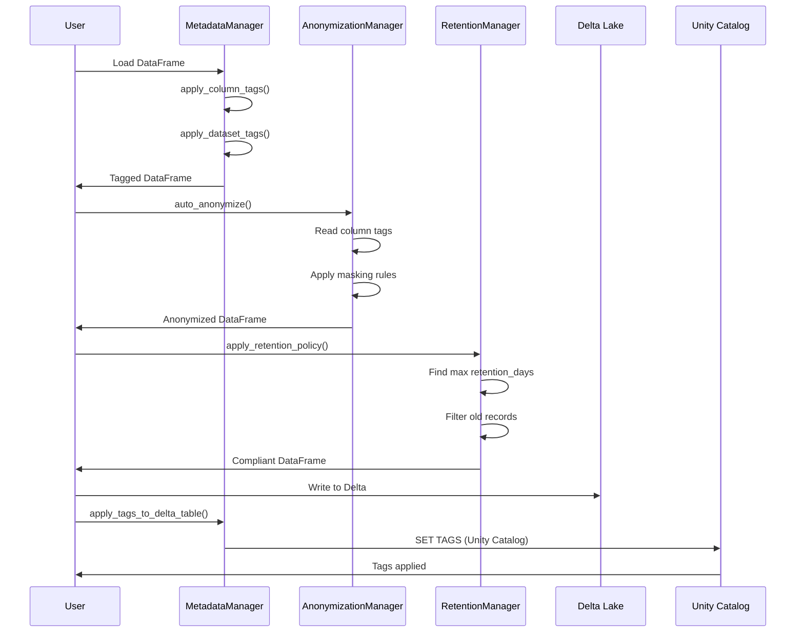

---

## GDPR Compliance Workflows

### Data Classification Flow

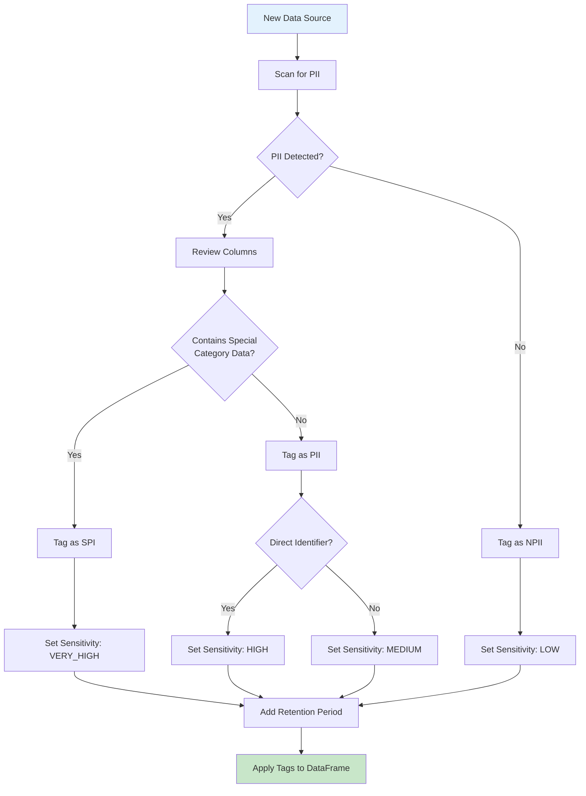

### Anonymization Decision Tree

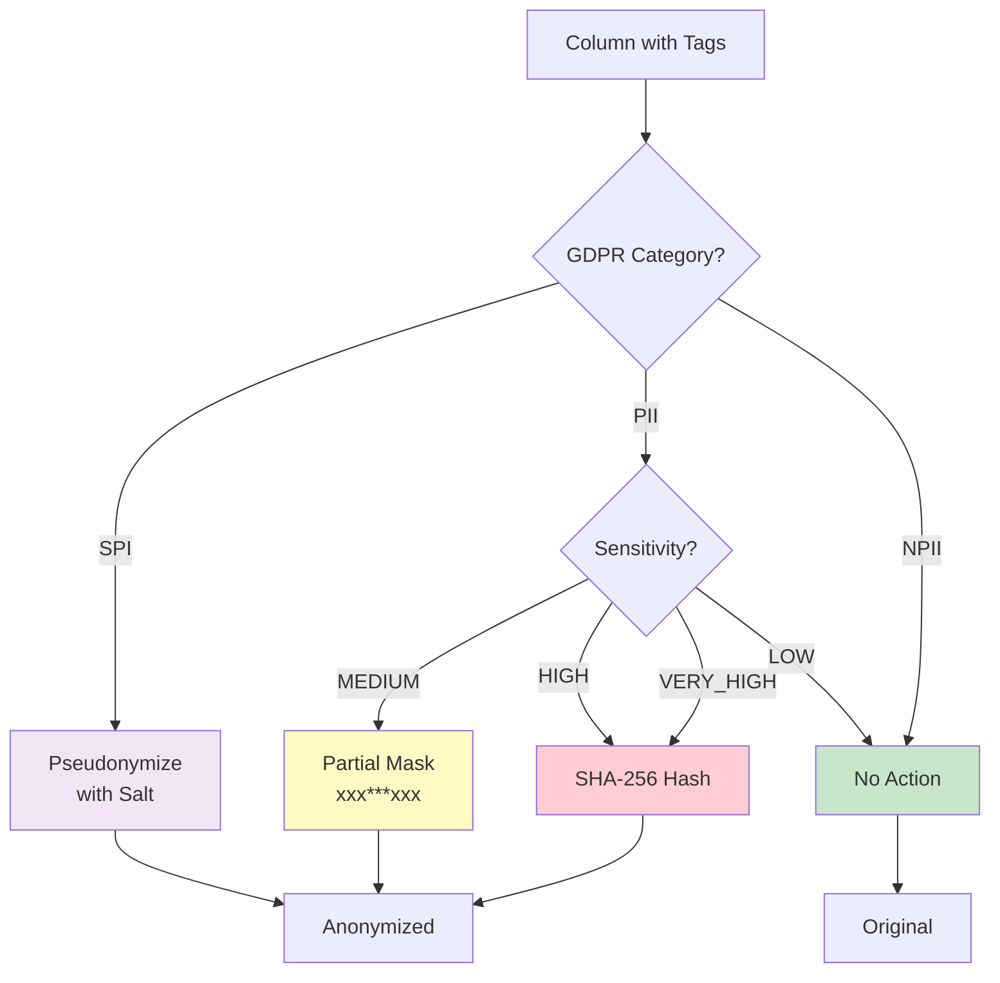

### Data Subject Erasure Flow (Right to be Forgotten)

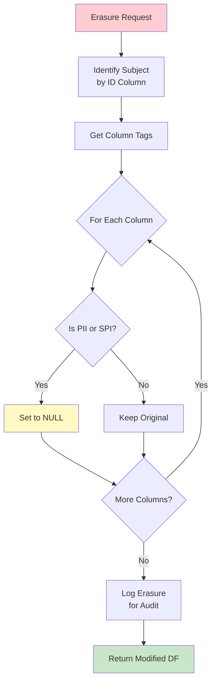

### Retention Policy Flow

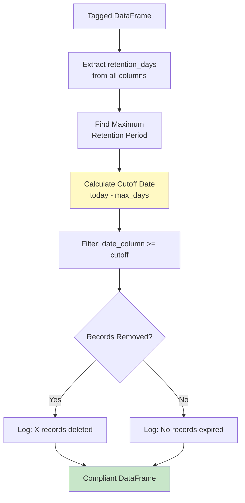

---

## Usage Examples

### Example 1: Complete GDPR Pipeline

```python
from pyspark.sql import SparkSession
from pyspark.sql.types import StructType, StructField, StringType, DoubleType, DateType
import datetime

from spart import MetadataManager, RetentionManager, AnonymizationManager

# Initialize Spark
spark = SparkSession.builder.appName("GDPR Pipeline").getOrCreate()

# Sample customer data
data = [
    ("USR001", "John Smith", "john@email.com", "123 Main St", 75000.0, datetime.date(2023, 1, 15)),
    ("USR002", "Jane Doe", "jane@email.com", "456 Oak Ave", 85000.0, datetime.date(2023, 6, 20)),
    ("USR003", "Bob Wilson", "bob@email.com", "789 Pine Rd", 65000.0, datetime.date(2024, 3, 10)),
]

schema = StructType([
    StructField("user_id", StringType(), True),
    StructField("name", StringType(), True),
    StructField("email", StringType(), True),
    StructField("address", StringType(), True),
    StructField("salary", DoubleType(), True),
    StructField("created_date", DateType(), True)
])

df = spark.createDataFrame(data, schema)

# Initialize managers
metadata_mgr = MetadataManager(spark)
retention_mgr = RetentionManager(metadata_mgr)
anon_mgr = AnonymizationManager(metadata_mgr)

# Step 1: Define GDPR tags
column_tags = {
    "user_id": {
        "gdpr_category": "PII",
        "sensitivity": "MEDIUM",
        "purpose": "identification",
        "retention_days": 3650  # 10 years
    },
    "name": {
        "gdpr_category": "PII",
        "sensitivity": "HIGH",
        "purpose": "identification",
        "retention_days": 3650
    },
    "email": {
        "gdpr_category": "PII",
        "sensitivity": "MEDIUM",
        "purpose": "contact",
        "retention_days": 1825  # 5 years
    },
    "address": {
        "gdpr_category": "PII",
        "sensitivity": "HIGH",
        "purpose": "location",
        "retention_days": 1825
    },
    "salary": {
        "gdpr_category": "SPI",
        "sensitivity": "VERY_HIGH",
        "purpose": "compensation",
        "retention_days": 2555  # 7 years
    },
    "created_date": {
        "gdpr_category": "NPII",
        "sensitivity": "LOW",
        "purpose": "audit"
    }
}

# Step 2: Apply column tags
tagged_df = metadata_mgr.apply_column_tags(df, column_tags)

# Step 3: Apply dataset tags
dataset_tags = {
    "owner": "hr_department",
    "purpose": "employee_management",
    "classification": "CONFIDENTIAL",
    "legal_basis": "employment_contract"
}
tagged_df = metadata_mgr.apply_dataset_tags(tagged_df, dataset_tags)

# Step 4: Export metadata catalog
metadata_mgr.export_metadata_catalog(tagged_df, "gdpr_catalog.json")

# Step 5: Apply anonymization for analytics
anonymized_df = anon_mgr.auto_anonymize(tagged_df)
print("Anonymized data for analytics:")
anonymized_df.select("user_id", "name", "email", "salary").show(truncate=False)

# Step 6: Apply retention policy
compliant_df = retention_mgr.apply_retention_policy(tagged_df, "created_date")
print(f"Records after retention policy: {compliant_df.count()}")

# Step 7: Handle erasure request
erased_df = anon_mgr.request_erasure(tagged_df, "user_id", "USR002")
print("After erasure request for USR002:")
erased_df.show(truncate=False)
```

### Example 2: Custom Masking Rules

```python
# Apply specific masking techniques
mask_rules = {
    "email": "partial",      # john@email.com -> joh***com
    "address": "redact",     # 123 Main St -> [REDACTED]
    "name": "hash"           # John Smith -> a1b2c3d4...
}

masked_df = anon_mgr.mask_columns(tagged_df, mask_rules)
masked_df.show(truncate=False)
```

### Example 3: Consistent Pseudonymization

```python
# Use consistent salt for reproducible pseudonyms
SALT = "my-secure-salt-store-in-secrets-manager"

pseudo_df = anon_mgr.pseudonymize_columns(
    tagged_df,
    columns=["user_id", "email"],
    salt=SALT
)

# Same salt = same pseudonym (for joins across datasets)
pseudo_df.show(truncate=False)
```

### Example 4: PII Scanning

```python
# Scan for potential PII based on column names
pii_results = metadata_mgr.scan_for_pii(df)

print("Potential PII columns:", pii_results["potential_pii"])
print("Potential SPI columns:", pii_results["potential_spi"])
print("Potential security columns:", pii_results["potential_secure"])
```

### Example 5: Full GDPR Pipeline with Consent and Audit

```python
from spart import (
    ConfigManager, AuditManager, ConsentManager,
    MetadataManager, AnonymizationManager, PIIDetector,
    ConsentStatus
)

# Initialize with configuration
config = ConfigManager("gdpr_config.yaml")
audit = AuditManager(config, log_path="./audit_logs")
metadata_mgr = MetadataManager(spark, config=config, audit_manager=audit)
consent_mgr = ConsentManager(spark, config, audit, storage_path="./consent")
anon_mgr = AnonymizationManager(metadata_mgr, audit)

# 1. Scan for PII
detector = PIIDetector(config)
scan_results = detector.full_scan(df, sample_size=100)
suggested_tags = detector.get_suggested_tags(scan_results)

# 2. Apply tags
tagged_df = metadata_mgr.apply_column_tags(df, suggested_tags)

# 3. Check consent before processing
user_id = "USR001"
has_consent, _ = consent_mgr.check_consent(user_id, "analytics")

if has_consent:
    # 4. Anonymize for analytics
    anon_df = anon_mgr.auto_anonymize(tagged_df)

    # 5. All operations are automatically audited
    events = audit.get_events(actor="system")

# 6. Generate compliance report
report = audit.generate_compliance_report(
    start=datetime.now() - timedelta(days=30),
    end=datetime.now()
)
```

---

## Pandas Backend & Performance

spark-anon provides a fast pandas backend for datasets that don't require distributed processing. This can provide 10-100x speedup for smaller datasets.

### When to Use Pandas vs Spark

| Dataset Size | Recommended Backend | Reason |
|-------------|---------------------|--------|
| < 10,000 rows | Pandas | Much faster, no overhead |
| 10,000 - 100,000 rows | Pandas | Still faster, fits in memory |
| > 100,000 rows | Spark | Distributed processing needed |
| Streaming data | Spark | Structured Streaming support |

### Performance Comparison

```python
from spart import Benchmark

benchmark = Benchmark(spark)
results = benchmark.run_benchmark_suite(
    row_counts=[1000, 10000, 100000, 1000000],
    operations=["hash", "partial_mask", "k_anonymize"]
)

# Typical results:
# | Rows    | Operation    | Pandas (s) | Spark (s) | Winner |
# |---------|--------------|------------|-----------|--------|
# | 1,000   | hash         | 0.02       | 2.5       | Pandas |
# | 10,000  | hash         | 0.15       | 2.8       | Pandas |
# | 100,000 | hash         | 1.5        | 3.2       | Pandas |
# | 1M      | hash         | 15.0       | 8.5       | Spark  |
```

### Automatic Backend Selection

```python
from spart import BackendSelector, ProcessingBackend

selector = BackendSelector(spark, pandas_threshold_rows=100000)

# Automatically choose best backend
def process_data(df):
    row_count = df.count()
    backend = selector.get_backend(row_count)

    if backend == ProcessingBackend.PANDAS:
        pdf = selector.convert_spark_to_pandas(df)
        processor = PandasProcessor()
        result = processor.auto_anonymize(pdf)
        return selector.convert_pandas_to_spark(result)
    else:
        return anon_mgr.auto_anonymize(df)
```

---

## CLI Interface

spark-anon provides a command-line interface for common operations.

### Basic Usage

```bash
# Scan a file for PII
python -m spart scan --input data.parquet --output pii_report.json

# Anonymize a file
python -m spart anonymize \
    --input data.parquet \
    --output anonymized.parquet \
    --config gdpr_config.yaml

# Generate compliance report
python -m spart report \
    --audit-path ./audit_logs \
    --start 2024-01-01 \
    --end 2024-12-31 \
    --output compliance_report.json

# Handle erasure request
python -m spart erase \
    --input data.parquet \
    --output erased.parquet \
    --subject-id USR001 \
    --id-column user_id

# Benchmark backends
python -m spart benchmark \
    --rows 10000 50000 100000 \
    --output benchmark_results.json
```

### Configuration File (YAML)

Following the [12-factor app](https://12factor.net/) methodology, configuration is managed through YAML files with environment variable overrides.

```yaml
# gdpr_config.yaml
metadata:
  column_name: "_metadata"
  dataset_id_prefix: "DS"

anonymization:
  default_hash_algorithm: "sha256"
  k_anonymity_default_k: 5
  differential_privacy_default_epsilon: 1.0

processing:
  pandas_threshold_rows: 100000
  default_backend: "auto"

consent:
  default_expiry_days: 365
  valid_purposes:
    - analytics
    - marketing
    - research
    - personalization

audit:
  log_path: "./audit_logs"
  retention_days: 2555  # 7 years

pii_detection:
  patterns:
    email: "[a-zA-Z0-9._%+-]+@[a-zA-Z0-9.-]+\\.[a-zA-Z]{2,}"
    phone: "\\+?[1-9]\\d{1,14}"
    ssn: "\\d{3}-\\d{2}-\\d{4}"
    credit_card: "\\d{4}[- ]?\\d{4}[- ]?\\d{4}[- ]?\\d{4}"
```

### Environment Variable Overrides

Environment variables override YAML configuration (12-factor app pattern):

```bash
# Override processing threshold
export SPART_PROCESSING_PANDAS_THRESHOLD_ROWS=50000

# Override K-anonymity default
export SPART_ANONYMIZATION_K_ANONYMITY_DEFAULT_K=10

# Override audit log path
export SPART_AUDIT_LOG_PATH=/var/log/spart/audit
```

---

## Integration with Databricks & Unity Catalog

### Architecture with Unity Catalog

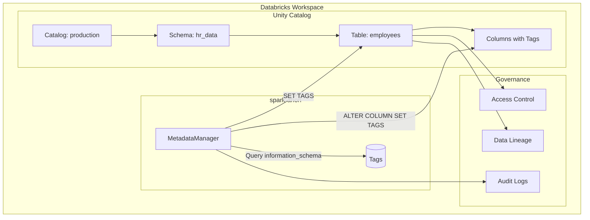

### Unity Catalog Table Tags

```python
# Apply table-level tags (Unity Catalog)
metadata_mgr.apply_tags_to_delta_table(
    "production.hr_data.employees",
    {
        "contains_pii": "true",
        "data_owner": "hr_department",
        "retention_policy": "7_years",
        "gdpr_lawful_basis": "employment_contract"
    },
    use_unity_catalog=True
)
```

### Unity Catalog Column Tags

```python
# Apply column-level tags (Unity Catalog)
column_tags = {
    "email": {
        "pii": "true",
        "sensitivity": "medium",
        "gdpr_category": "PII"
    },
    "salary": {
        "pii": "true",
        "sensitivity": "very_high",
        "gdpr_category": "SPI"
    }
}

metadata_mgr.apply_column_tags_to_delta_table(
    "production.hr_data.employees",
    column_tags
)
```

### Retrieve Existing Tags

```python
# Get tags from Unity Catalog table
tags = metadata_mgr.get_table_tags("production.hr_data.employees")
print(tags)
# {'contains_pii': 'true', 'data_owner': 'hr_department', ...}
```

### Unity Catalog vs Hive Metastore

| Feature | Unity Catalog | Hive Metastore |
|---------|---------------|----------------|
| Table naming | `catalog.schema.table` | `schema.table` |
| Table tags | `SET TAGS` | `SET TBLPROPERTIES` |
| Column tags | ✅ Supported | ❌ Not supported |
| Tag retrieval | `information_schema.table_tags` | `SHOW TBLPROPERTIES` |
| Access control | Fine-grained | Limited |
| Data lineage | Built-in | Not available |

---

## Metadata Catalog

The metadata catalog provides a complete snapshot of your data governance configuration.

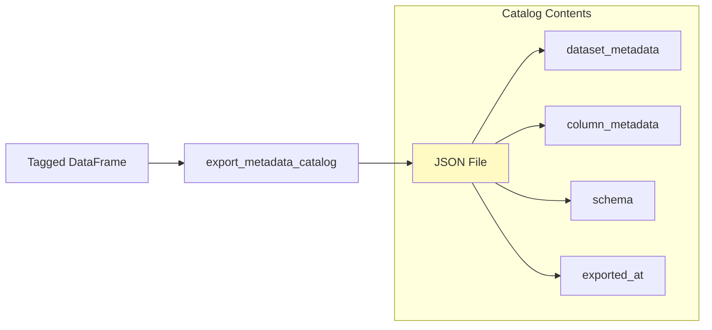

### Catalog Structure

```json
{
  "dataset_metadata": {
    "owner": "hr_department",
    "purpose": "employee_management",
    "classification": "CONFIDENTIAL",
    "timestamp": "2024-01-25T14:30:00",
    "dataset_id": "uuid-here"
  },
  "column_metadata": {
    "email": {
      "gdpr_category": "PII",
      "sensitivity": "MEDIUM",
      "retention_days": 1825,
      "purpose": "contact"
    },
    "salary": {
      "gdpr_category": "SPI",
      "sensitivity": "VERY_HIGH",
      "retention_days": 2555,
      "purpose": "compensation"
    }
  },
  "schema": "StructType([...])",
  "exported_at": "2024-01-25T14:30:00"
}
```

---

## Testing

Run the comprehensive test suite:

```bash
python test_spart.py
```

### Test Coverage

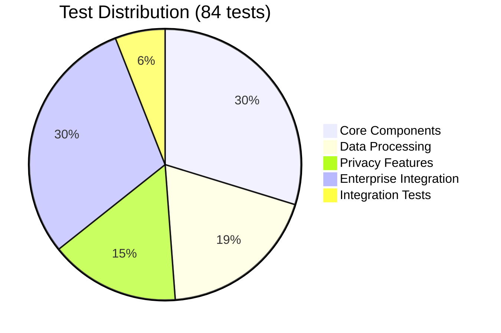

**Detailed Test Breakdown:**
- **Core:** Enums (7), ConfigManager (6), AuditManager (5), ConsentManager (5), MetadataManager (6)
- **Processing:** PandasProcessor (9), Benchmark (3), BackendSelector (4), Databricks (4), RetentionManager (2), AnonymizationManager (6)
- **Privacy:** PIIDetector (5), AdvancedAnonymization (5)
- **Enterprise:** ApacheAtlasClient (5), AWSGlueCatalogClient (5), MLPIIDetector (6), DataLineageTracker (9)
- **Integration:** Full pipeline (2)

| Test Category | Tests | Coverage |
|---------------|-------|----------|
| Enums & DataClasses | 7 | GDPRCategory, SensitivityLevel, ConsentStatus, records |
| ConfigManager | 6 | Defaults, nested values, validation, save/load |
| AuditManager | 5 | Event logging, queries, compliance reports |
| ConsentManager | 5 | Record, check, withdraw consent, validation |
| PIIDetector | 5 | Column scanning, content scanning, custom patterns |
| AdvancedAnonymization | 5 | K-anonymity, differential privacy, generalization |
| PandasProcessor | 9 | All masking types, k-anonymity, erasure |
| Benchmark | 3 | Recommendations, benchmarking, results tracking |
| BackendSelector | 4 | Auto-selection, forced backend, conversion |
| Databricks/Unity Catalog | 4 | Environment detection, error handling |
| MetadataManager | 6 | Tagging, validation, PII scan, export |
| RetentionManager | 2 | Retention policy application, no tags warning |
| AnonymizationManager | 6 | All masking types, erasure |
| **ApacheAtlasClient** | 5 | Initialization, classifications, sync, entity queries |
| **AWSGlueCatalogClient** | 5 | Initialization, table/column tags, compliance reports |
| **MLPIIDetector** | 6 | Backend selection, text detection, custom patterns, scanning |
| **DataLineageTracker** | 9 | Lineage graph, transformations, impact analysis, DSAR |
| Integration | 2 | Full pipeline, audit integration |
| **Total** | **84** | **Full coverage of all GDPR compliance features** |

---

## Performance Optimizations

### Batch Operations

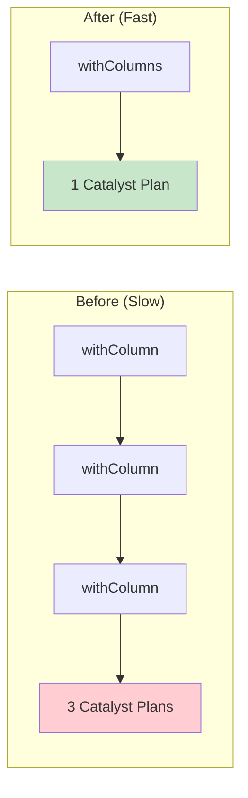

**Performance Benefits:**
- Single logical plan instead of chained transformations
- Reduced Catalyst optimizer overhead
- Cleaner execution plans
- Lower memory footprint

### Optimization Techniques Used

| Technique | Where Applied | Benefit |
|-----------|---------------|---------|
| `withColumns()` batch | mask_columns, pseudonymize, erasure | 3-5x faster |
| Lazy evaluation | Metadata parsing | Reduced memory |
| Partition hints | Retention filtering | Better parallelism |

---

## Security Considerations

### SQL Injection Protection

```python
# All inputs are sanitized before SQL execution
sanitized_tags = {
    k.replace("'", "''").replace("\\", "\\\\"):
    v.replace("'", "''").replace("\\", "\\\\")
    for k, v in tags.items()
}
```

### Best Practices

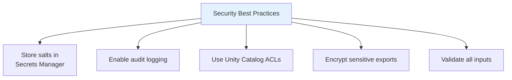

1. **Salt Management**: Store pseudonymization salts in AWS Secrets Manager, Azure Key Vault, or Databricks Secrets
2. **Audit Logging**: Enable Spark event logging for compliance
3. **Access Control**: Use Unity Catalog for fine-grained permissions
4. **Encryption**: Encrypt metadata catalog exports for sensitive environments

---

## Troubleshooting

### Common Issues

| Issue | Cause | Solution |
|-------|-------|----------|
| `EnvironmentError: Databricks` | Using UC methods outside Databricks | Use `use_unity_catalog=False` or run in Databricks |
| `ValueError: Invalid GDPR category` | Typo in category name | Use: `PII`, `SPI`, or `NPII` |
| `Column not found` | Column name mismatch | Check column names with `df.columns` |
| Tags not persisting | DataFrame recreated | Apply tags after final transformations |

### Debug Mode

```python
import logging
logging.getLogger("spart").setLevel(logging.DEBUG)
```

---

## Roadmap

### Current Status

All planned features from Phase 1, 2, and 3 have been implemented.

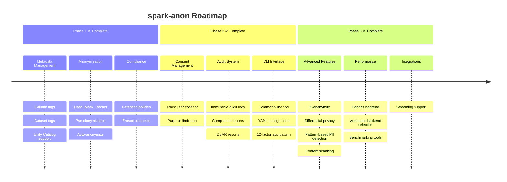

### Implemented Features

| Feature | Status | Description |
|---------|--------|-------------|
| ConfigManager | ✅ Complete | YAML configuration with environment overrides |
| AuditManager | ✅ Complete | Immutable audit logs, compliance & DSAR reports |
| ConsentManager | ✅ Complete | Consent tracking with expiration and purposes |
| PIIDetector | ✅ Complete | Column name and content pattern scanning |
| AdvancedAnonymization | ✅ Complete | K-anonymity, differential privacy, generalization |
| PandasProcessor | ✅ Complete | Fast pandas backend for smaller datasets |
| BackendSelector | ✅ Complete | Automatic optimal backend selection |
| Benchmark | ✅ Complete | Performance comparison tools |
| StreamingManager | ✅ Complete | Real-time streaming anonymization |
| CLI Interface | ✅ Complete | Command-line operations |

### Phase 4: Enterprise Integration (Complete)

| Feature | Status | Description |
|---------|--------|-------------|
| ApacheAtlasClient | ✅ Complete | Enterprise metadata catalog integration |
| AWSGlueCatalogClient | ✅ Complete | AWS-native data governance |
| MLPIIDetector | ✅ Complete | ML-based PII detection using NLP |
| DataLineageTracker | ✅ Complete | Data lineage tracking for GDPR compliance |

---

## Contributing

Contributions are welcome! Please follow these steps:

1. Fork the repository
2. Create a feature branch (`git checkout -b feature/AmazingFeature`)
3. Write tests for new functionality
4. Ensure all tests pass (`python test_spart.py`)
5. Run code quality checks (`ty check spart.py && ruff check spart.py`)
6. Commit changes (`git commit -m 'Add AmazingFeature'`)
7. Push to branch (`git push origin feature/AmazingFeature`)
8. Open a Pull Request

---

## License

This project is open source. See LICENSE file for details.

---

## References

- [GDPR Official Text](https://gdpr-info.eu/)
- [12-Factor App Methodology](https://12factor.net/) - Configuration management pattern
- [PySpark Documentation](https://spark.apache.org/docs/latest/api/python/)
- [Databricks Unity Catalog](https://docs.databricks.com/data-governance/unity-catalog/index.html)
- [Delta Lake Documentation](https://docs.delta.io/)
- [K-Anonymity (Wikipedia)](https://en.wikipedia.org/wiki/K-anonymity)
- [Differential Privacy (Wikipedia)](https://en.wikipedia.org/wiki/Differential_privacy)
- [GDPR Article 17 - Right to Erasure](https://gdpr-info.eu/art-17-gdpr/)
- [GDPR Article 30 - Records of Processing](https://gdpr-info.eu/art-30-gdpr/)
